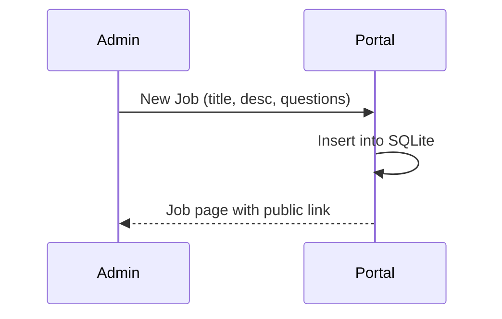

# Flows

## Admin creates job


## Candidate applies
```mermaid
sequenceDiagram
  participant Candidate
  participant Portal
  Candidate->>Portal: open /jp/apply/:job_id
  Candidate->>Portal: submit form + resume
  Portal->>Portal: parse resume; store text+file path
  Portal-->>Candidate: Application submitted
```

## Employer filters
```mermaid
sequenceDiagram
  participant Employer
  participant Portal
  Employer->>Portal: candidates view + optional params
  Portal->>Portal: heuristic filter
  Employer->>Portal: Suggest with Gemini (target N)
  Portal->>Gemini: compact corpus stats (~<=500 tokens)
  Gemini-->>Portal: {must_keywords, nice_keywords, min_words}
  Portal->>Portal: apply suggested filters locally; preview shortlist
```
