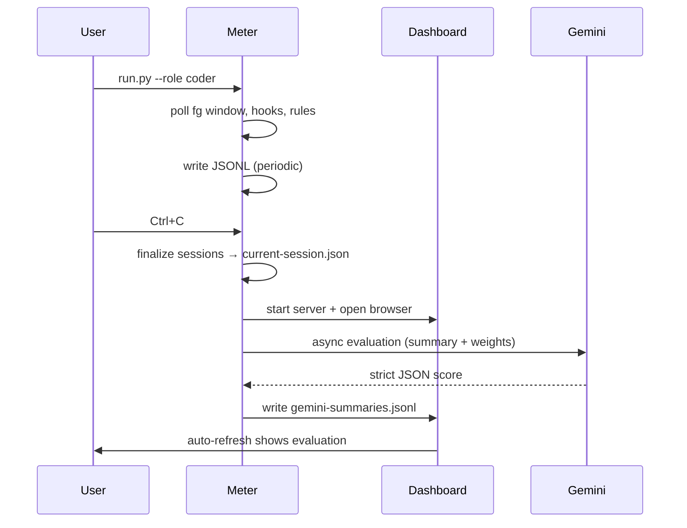

# Flows

## Run and Summarize

## Stress Analysis (UI)
- Dashboard loads last N days JSONL.
- Builds features (per-day WPM, totals, top apps).
- Calls Gemini with compact prompt.
- Displays level/score/confidence/signals.
